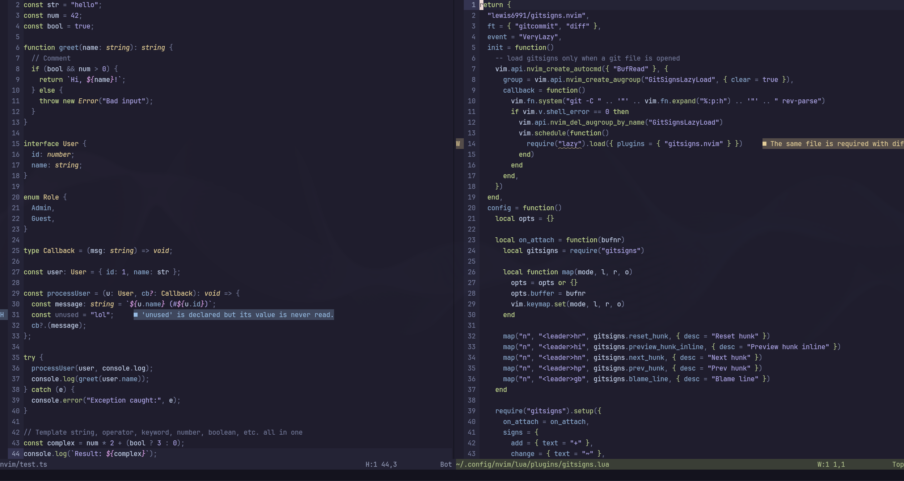

# Osmium

Dark metallic neovim theme



## Installation

Using lazy.nvim

```lua
{
    "IroncladDev/osmium",
    config = function()
        require("osmium").setup({
            integrations = {
                gitsigns = true,
                telescope = true,
                -- [...other integrations]
            },
            transparent_bg = false,
            show_end_of_buffer = false,
        })

        vim.cmd.colorscheme("osmium")
    end,
}
```

I have not tried installing this with something like packer. AFAIK you have to call the setup function with the desired options

## Configuration

```lua
require("osmium").setup({
    integrations = { -- optional
        -- all integrations are disabled by default
        -- set to true to enable
        gitsigns = false,
        telescope = false,
        indent_blankline = false,
    },
    transparent_bg = false, -- whether to use a transparent background
    show_end_of_buffer = false, -- whether to show the end of buffer
})
```

## Integrations

- [gitsigns](https://github.com/lewis6991/gitsigns.nvim)
- [telescope](https://github.com/nvim-telescope/telescope.nvim)
- [indent_blankline](https://github.com/lukas-reineke/indent-blankline.nvim)

## Contributing

PRs and issues are welcome. This is a work in progress and will undergo a lot of changes in the near future.

## Credits

The project structure was inspired by [dracula.nvim](https://github.com/Mofiqul/dracula.nvim) and has undergone a lot of mutilation from the original project
